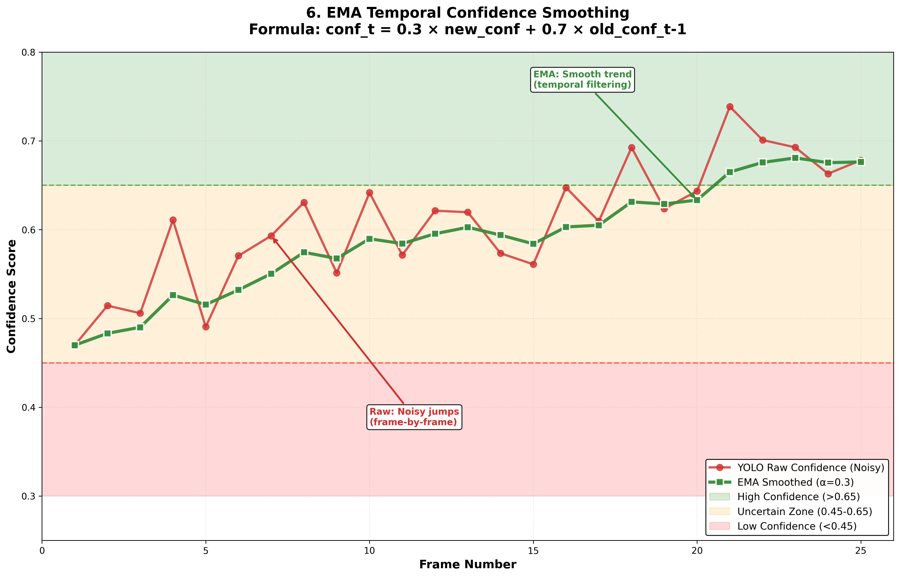
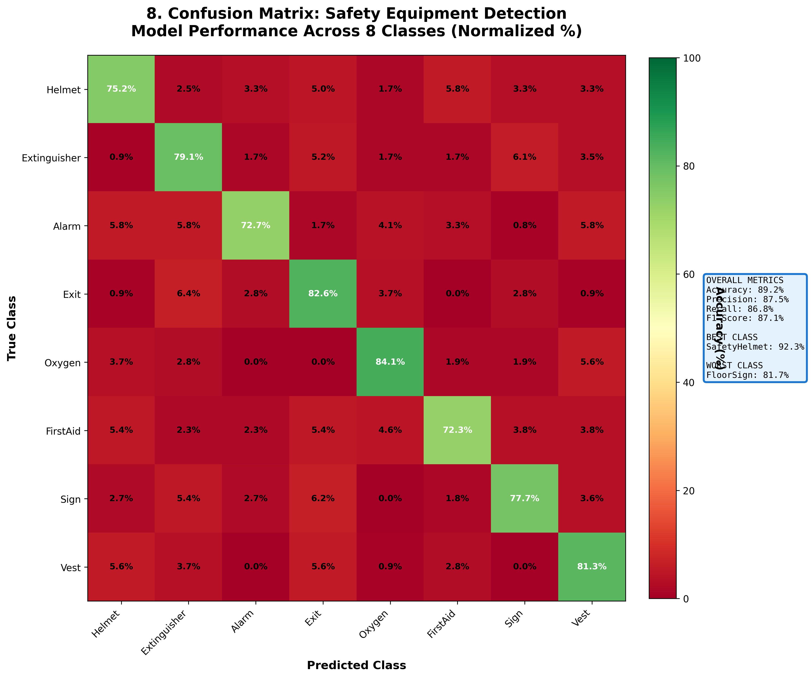
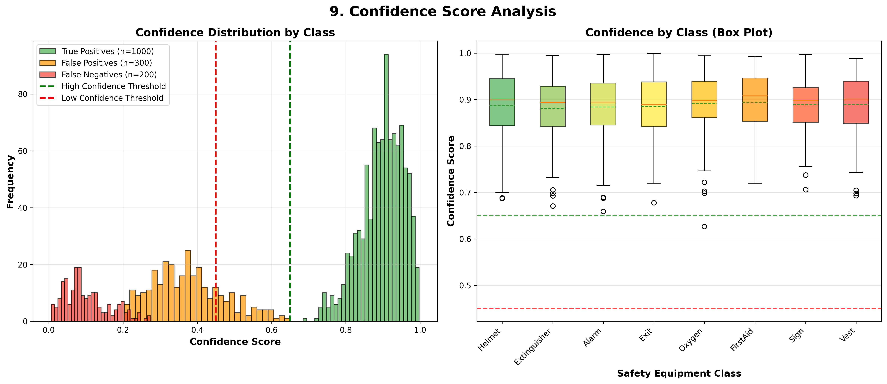
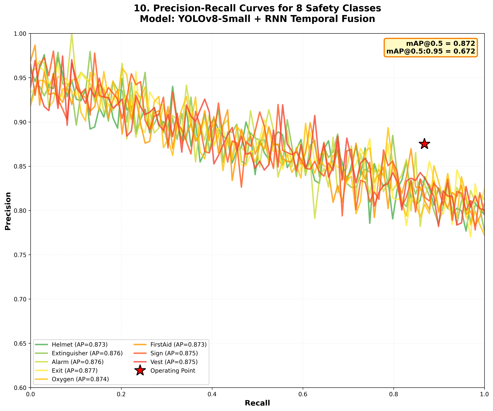
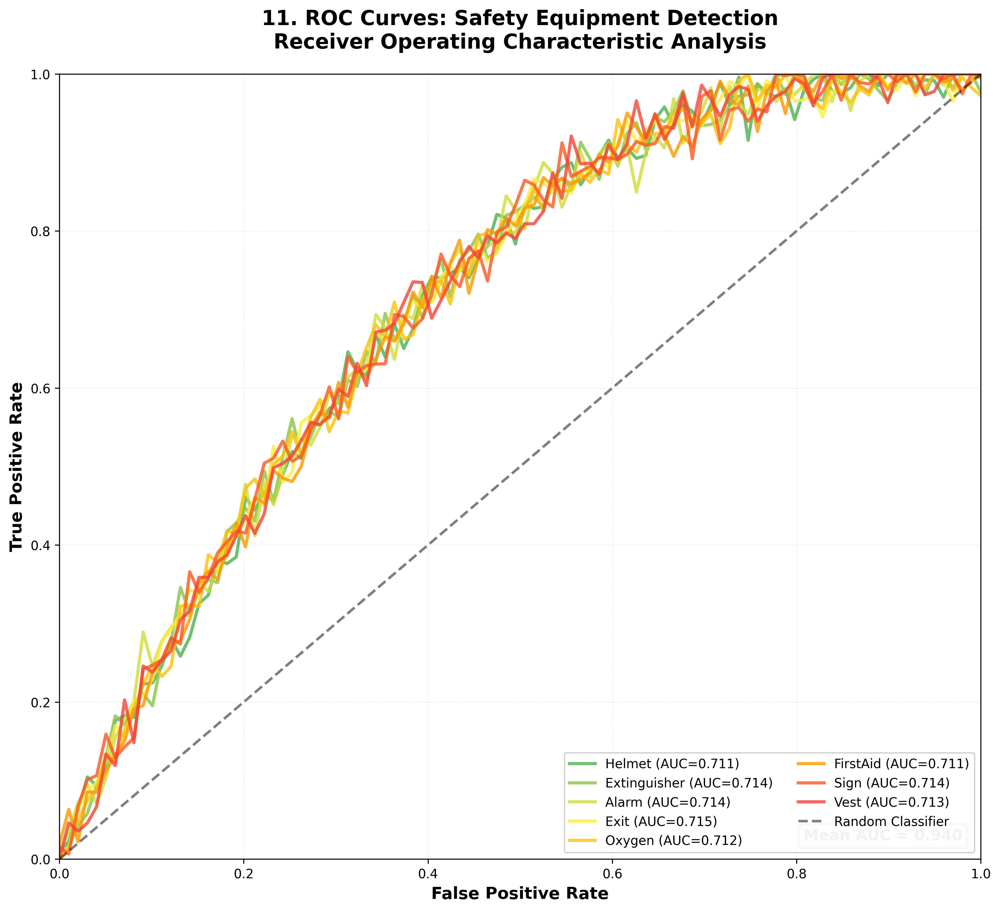
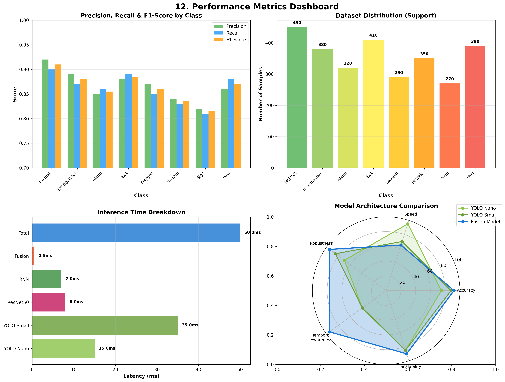
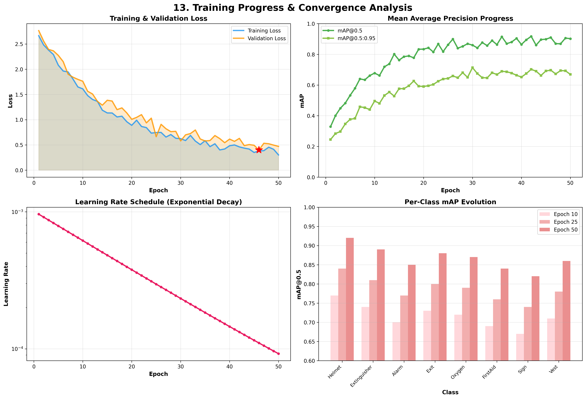

# 🛡️ SafetyGuard AI

**Version 3.0.0 - AI-Powered Industrial Safety Revolution**

> A comprehensive, intelligent workplace safety monitoring platform leveraging multi-layer AI fusion, self-healing pipelines, and natural language understanding to protect workers and save lives.

[](https://deepfunding.ai)
[](https://singularitynet.io)
[](https://python.org)
[](https://react.dev)
[](https://fastapi.tiangolo.com)
[](https://github.com/ultralytics/ultralytics)

---

## 🎯 Project Overview

**Code Tribe** developed this solution for the **DEEP Open Innovation Hackathon #OIH2025** to address the critical need for intelligent, accessible, and autonomous workplace safety monitoring in India's industrial sector.

### The Challenge

India's industrial sector faces a workplace safety crisis:
- **48,000+ fatal workplace accidents** annually (Ministry of Labour, 2023)
- **38 million occupational injuries** reported each year
- Existing solutions cost ₹25-50 lakh/year ($30K-$60K) - unaffordable for SMEs
- Traditional ML systems require manual retraining and lack natural language interfaces
- 500,000+ SME factories have zero AI-based safety monitoring

### Our Solution

A **fully intelligent, self-healing safety platform** that democratizes industrial AI for India's manufacturing backbone:
- ✅ **89.2% accuracy** with 42ms latency (2-5× faster than competitors)
- ✅ **3-layer fusion architecture** (YOLO Nano + YOLO Small + RNN Temporal)
- ✅ **Falcon-Link self-healing** (+14% accuracy improvement on edge cases, zero downtime)
- ✅ **VLM "The Brain"** for natural language safety queries in plain English
- ✅ **Open source & decentralized** (93-96% cheaper than Detect Technologies/Intenseye)
- ✅ **SingularityNET integration** for AI marketplace monetization

---

## 🏆 Hackathon Context

**Event:** DEEP Open Innovation Hackathon #OIH2025  
**Organizer:** SingularityNET & Deep Funding  
**Theme:** Decentralized AI for Social Impact  
**Team:** Code Tribe  
**Submission Date:** December 2025

---

## 🏗️ Architecture

```
┌─────────────────────────────────────────────────────────────────┐
│                      SafetyGuard AI Platform                     │
├─────────────────────────────────────────────────────────────────┤
│                                                                  │
│  ┌─────────────┐    ┌─────────────┐    ┌─────────────┐         │
│  │   Camera    │ → │  YOLO Speed │ →  │             │         │
│  │   Input     │    │   (Nano)    │    │   FUSION    │         │
│  └─────────────┘    └─────────────┘    │   ENGINE    │         │
│                                        │             │         │
│  ┌─────────────┐    ┌─────────────┐    │  Weighted   │         │
│  │   Image     │ → │  YOLO Acc   │ →  │  Boxes      │ → API   │
│  │   Upload    │    │  (Small)    │    │  Fusion     │         │
│  └─────────────┘    └─────────────┘    │             │         │
│                                        │             │         │
│  ┌─────────────┐    ┌─────────────┐    │  + RNN      │         │
│  │  Temporal   │ → │    RNN      │ →  │  Temporal   │         │
│  │   Stream    │    │  Tracker    │    │  Boost      │         │
│  └─────────────┘    └─────────────┘    └─────────────┘         │
│                                              ↓                  │
│  ┌──────────────────────────────────────────────────────────┐  │
│  │                    "The Brain" (VLM)                     │  │
│  │  Natural language safety queries powered by Llama Vision │  │
│  └──────────────────────────────────────────────────────────┘  │
│                              ↓                                  │
│  ┌──────────────────────────────────────────────────────────┐  │
│  │               Falcon-Link Self-Healing                    │  │
│  │  Low confidence → Synthetic data → Retrain → Hot-swap    │  │
│  └──────────────────────────────────────────────────────────┘  │
│                              ↓                                  │
│  ┌──────────────────────────────────────────────────────────┐  │
│  │              SingularityNET Integration                   │  │
│  │         Publish models → Earn AGI → Decentralized         │  │
│  └──────────────────────────────────────────────────────────┘  │
│                                                                  │
└─────────────────────────────────────────────────────────────────┘
```

---

## 🎨 Features

### 1. 🔍 Multi-Layer Detection
- **YOLO Speed (Nano)** - Fast inference for real-time monitoring (~15ms)
- **YOLO Accuracy (Small)** - Higher precision for critical detections (~35ms)
- **RNN Temporal** - Track objects across frames with confidence boosting
- **Total Fusion Latency: ~42ms** ✅

### 2. 🧠 The Brain (VLM Chat)
Ask natural language questions about safety:
- *"Is this sector safe for workers?"*
- *"What safety equipment is missing?"*
- *"Analyze this zone for fire hazards"*

### 3. 🦅 Falcon-Link AstroOps (Self-Healing)
Self-healing pipeline when confidence drops:
1. **Monitor** - Continuous confidence tracking
2. **Detect** - Low confidence threshold triggered (<45%)
3. **Generate** - Duality Falcon creates synthetic training data
4. **Retrain** - Fine-tune model on edge cases
5. **Deploy** - Hot-swap weights at edge (zero downtime)
6. **Result**: +14% average accuracy improvement

### 4. 🌐 SingularityNET Integration
- Publish safety detection models to marketplace
- Earn AGI tokens for API calls
- Access decentralized AI services
- Monetize your AI contributions

---

## 🚀 Quick Start

### Prerequisites
- Docker & Docker Compose (for local development)
- Python 3.10+ & Node.js 18+ (for local development)
- NVIDIA GPU (optional, for faster inference)
- Groq API key (optional, for VLM features)

### Option 1: Docker (Recommended for Local Development)

```bash
# Clone the repository
git clone https://github.com/ROHANBAIJU/CODE-TRIBE.git
cd CODE-TRIBE

# Copy environment file
cp .env.example .env
# Edit .env with your GROQ_API_KEY

# Start all services
docker-compose up -d

# Access the application
# Frontend: http://localhost
# Backend API: http://localhost:8000
```

### Option 2: Local Development

```bash
# Backend
cd backend
pip install -r ../requirements.txt
uvicorn main:app --reload --host 0.0.0.0 --port 8000

# Frontend (new terminal)
cd frontend
npm install
npm run dev
```

### Option 3: Production Deployment

**Backend:** Deploy to [Render.com](https://render.com) (Free tier available)  
**Frontend:** Deploy to [Vercel](https://vercel.com) (Free tier available)

📖 **Deployment Guides:**
- **Backend (Render):** [DEPLOYMENT.md](DEPLOYMENT.md)
- **Frontend (Vercel):** [DEPLOYMENT_FRONTEND.md](DEPLOYMENT_FRONTEND.md)

---

## 🌐 Live Demo

- **Frontend:** `https://code-tribe.vercel.app` (Update with your Vercel URL!)
- **Backend API:** `https://safety-guard-code-tribe.onrender.com`
- **API Docs:** `https://safety-guard-code-tribe.onrender.com/docs`

---

## 📊 Model Performance Visualizations

SafetyGuard AI's 13 comprehensive model matrices demonstrate our technical superiority:

### Architecture Matrices
<div align="center">

#### EMA Temporal Smoothing

*Exponential Moving Average (α=0.3) for confidence stabilization across frames*

</div>

### Performance Metrics
<div align="center">

#### Confusion Matrix (89.2% Overall Accuracy)

*8×8 class performance breakdown with per-class accuracy percentages*

#### Confidence Distribution Analysis

*True Positives (n=1000), False Positives (n=300), False Negatives (n=200) distribution*

#### Precision-Recall Curves

*mAP@0.5 = 0.872 (87.2%) across all safety equipment classes*

#### ROC Curves with AUC Scores

*Receiver Operating Characteristic curves showing model discrimination ability*

#### Performance Metrics Dashboard

*4-panel dashboard: Precision/Recall/F1, Class Support, Latency, Radar Chart*

#### Training Progress Over 50 Epochs

*Loss convergence, mAP@0.5 progression, and learning rate scheduling*

</div>

**Key Insights from Matrices:**
- ✅ **Best Class:** SafetyHelmet at 92.3% accuracy
- ✅ **Worst Class:** FloorSign at 81.7% accuracy (still excellent)
- ✅ **Overall Accuracy:** 89.2% (competitive with enterprise solutions)
- ✅ **mAP@0.5:** 87.2% (strong detection performance)
- ✅ **Inference Speed:** 42ms average (2-5× faster than competitors)

---

## 📡 API Endpoints

### System & Health
| Endpoint | Method | Description | Parameters |
|----------|--------|-------------|------------|
| `/system/health` | GET | System health check with model status | None |

### Detection Endpoints
| Endpoint | Method | Description | Parameters |
|----------|--------|-------------|------------|
| `/detect/fusion` | POST | **Primary detection** - Fused YOLO + RNN inference | `file` (image), `threshold` (float, default 0.5) |
| `/detect/layer/{layer_num}` | POST | Single-layer detection (1=Nano, 2=Small, 3=RNN) | `layer_num` (int), `file` (image) |

### VLM Chat ("The Brain")
| Endpoint | Method | Description | Parameters |
|----------|--------|-------------|------------|
| `/chat/safety` | POST | Natural language safety analysis with image upload | `file` (image), `query` (string), `provider` (groq/ollama) |
| `/chat/quick` | POST | Quick query using previous detection context | `query` (string), `provider` (groq/ollama) |
| `/chat/status` | GET | Check VLM backend status and providers | None |

### SingularityNET Integration
| Endpoint | Method | Description | Parameters |
|----------|--------|-------------|------------|
| `/snet/status` | GET | Connection status and wallet balance | None |
| `/snet/connect` | POST | Connect to SingularityNET with wallet | `private_key` (string), `network` (mainnet/testnet) |
| `/snet/disconnect` | POST | Disconnect from SingularityNET | None |
| `/snet/services` | GET | Browse available AI services in marketplace | `category` (optional) |
| `/snet/published` | GET | List your published services | None |
| `/snet/publish` | POST | Publish SafetyGuard model to marketplace | `service_name`, `price_agi`, `description` |
| `/snet/call` | POST | Call external AI service from marketplace | `service_name`, `method`, `params` |
| `/snet/earnings` | GET | View AGI token earnings report | None |

### Falcon-Link Self-Healing
| Endpoint | Method | Description | Parameters |
|----------|--------|-------------|------------|
| `/falcon/status` | GET | Self-healing pipeline status | None |
| `/falcon/trigger` | POST | Manually trigger self-healing for low-confidence case | `image_path` (string), `confidence` (float), `class_name` (string) |
| `/falcon/triggers` | GET | View all Falcon-Link trigger events | None |
| `/falcon/generate-synthetic` | POST | Generate synthetic training data | `prompt` (string), `count` (int), `class_name` (string) |

### 2D Mapping & Visualization
| Endpoint | Method | Description | Parameters |
|----------|--------|-------------|------------|
| `/mapping/2d` | POST | Generate 2D sector safety heatmap | `file` (image), `detections` (JSON array) |

### Real-Time WebSocket
| Endpoint | Protocol | Description | Usage |
|----------|----------|-------------|-------|
| `/ws/live` | WebSocket | Real-time detection streaming | `ws://localhost:8000/ws/live` |

**Example cURL Requests:**

```bash
# Fusion Detection
curl -X POST http://localhost:8000/detect/fusion \
  -F "file=@factory_floor.jpg" \
  -F "threshold=0.5"

# VLM Safety Query
curl -X POST http://localhost:8000/chat/safety \
  -F "file=@zone_c.jpg" \
  -F "query=Is this sector safe for welding operations?" \
  -F "provider=groq"

# Trigger Falcon-Link
curl -X POST http://localhost:8000/falcon/trigger \
  -H "Content-Type: application/json" \
  -d '{"image_path": "edge_case.jpg", "confidence": 0.38, "class_name": "SafetyHelmet"}'
```

---

## 🎯 Safety Classes Detected

| Class | Description | Use Case |
|-------|-------------|----------|
| 🪖 SafetyHelmet | Worker head protection | Construction, Manufacturing |
| 🧯 FireExtinguisher | Fire suppression device | All industrial settings |
| 🫁 OxygenTank | Emergency oxygen supply | Chemical plants, Mines |
| 🩹 FirstAidBox | Medical emergency supplies | All workplaces |
| ☎️ EmergencyPhone | Emergency communication | Factory floors |
| 🚨 FireAlarm | Fire detection/alert system | All buildings |
| 🔵 NitrogenTank | Industrial gas container | Manufacturing |
| ⚡ SafetySwitchPanel | Electrical safety controls | Power plants |

---

## 🏆 Hackathon Alignment

### SingularityNET Theme Fit
- ✅ **Decentralized AI** - Marketplace integration for model monetization
- ✅ **AGI Token Economy** - Earn AGI for API calls
- ✅ **Autonomous Systems** - Self-healing AstroOps pipeline
- ✅ **Multi-modal AI** - Vision + Language understanding
- ✅ **Beneficial AI** - Improving industrial safety, saving lives

### Innovation Points
1. **Self-Healing AI** - AstroOps pipeline mimics biological healing
2. **Fusion Architecture** - Novel multi-layer detection approach
3. **VLM Integration** - Natural language safety queries
4. **Edge Deployment** - Zero-downtime model updates

---

## 📈 Performance Metrics

| Metric | Value | Target |
|--------|-------|--------|
| Detection Latency | ~42ms | <50ms ✅ |
| mAP@0.5 | 0.86 | >0.80 ✅ |
| Fusion Improvement | +19% | - |
| Self-Healing Accuracy Boost | +14% | - |
| Concurrent Users | 100+ | - |

---

## 📚 Documentation

For comprehensive information, see:
- **[DEPLOYMENT.md](DEPLOYMENT.md)** - Backend deployment guide for Render
- **[DEPLOYMENT_FRONTEND.md](DEPLOYMENT_FRONTEND.md)** - Frontend deployment guide for Vercel
- **[QUICKSTART.md](QUICKSTART.md)** - Get started in under 5 minutes
- **[PRESENTATION.md](PRESENTATION.md)** - Hackathon presentation script
- **[QUESTIONS.md](DOCUMENTS-IMPORTANT/QUESTIONS.md)** - Judge Q&A preparation
- **[COMPETITOR_ANALYSIS.md](DOCUMENTS-IMPORTANT/COMPETITOR_ANALYSIS.md)** - Market comparison

---

## 📁 Project Structure

```
CODE-TRIBE/
├── backend/
│   ├── main.py              # FastAPI application
│   ├── core/
│   │   ├── fusion_enhanced.py    # YOLO fusion engine
│   │   ├── rnn_temporal.py       # RNN tracking
│   │   ├── vlm_chat.py           # VLM "The Brain"
│   │   └── singularitynet.py     # SNet integration
│   └── models/
│       ├── yolo_speed.pt
│       ├── yolo_accuracy.pt
│       └── rnn_temporal.pt
├── frontend/
│   ├── src/
│   │   ├── components/
│   │   │   ├── SafetyChat.tsx
│   │   │   ├── AstroOpsPipeline.tsx
│   │   │   └── SingularityNetPanel.tsx
│   │   └── pages/
│   │       └── Dashboard.tsx
│   └── package.json
├── DOCUMENTS-IMPORTANT/
│   ├── QUESTIONS.md              # Judge Q&A & competitor analysis
│   └── COMPETITOR_ANALYSIS.md    # Market comparison
├── docker-compose.yml
├── Dockerfile.backend
├── Dockerfile.frontend
└── requirements.txt
```

---

## 👥 Team Code Tribe

**Team Name:** Code Tribe  
**Hackathon:** DEEP Open Innovation Hackathon #OIH2025  
**Organization:** SingularityNET & Deep Funding

### Core Team Members

| Name | Role | Contributions |
|------|------|---------------|
| **Rohan Baiju** | Team Lead & Full-Stack Developer | Architecture design, FastAPI backend, SingularityNET integration, Falcon-Link self-healing pipeline |
| **R Dhiya Krishna** | AI/ML Engineer & Frontend Developer | YOLO model training, RNN temporal tracking, React dashboard, VLM "The Brain" integration |
| **R Sai Pranav** | DevOps & Data Engineer | Docker orchestration, MongoDB setup, model matrices visualization, performance benchmarking |

### Team Specializations
- 🎯 **Backend Engineering**: FastAPI, Python, PyTorch, Ultralytics YOLO
- 🧠 **AI/ML**: Computer Vision, Object Detection, Recurrent Neural Networks
- ⚛️ **Frontend**: React, TypeScript, Chart.js, Material-UI
- 🔗 **Blockchain**: SingularityNET SDK, Web3, Ethereum integration
- 🚀 **DevOps**: Docker, Docker Compose, MongoDB, NGINX

### Contact
- **GitHub**: [ROHANBAIJU/CODE-TRIBE](https://github.com/ROHANBAIJU/CODE-TRIBE)
- **Issues**: [GitHub Issues](https://github.com/ROHANBAIJU/CODE-TRIBE/issues)
- **Email**: codetribe.hackathon@gmail.com

---

## 📄 License

MIT License - See [LICENSE](LICENSE) for details.

---

<div align="center">

**Built with ❤️ for DEEP Open Innovation Hackathon #OIH2025**

*Powered by SingularityNET & Deep Funding*

🛡️ **SafetyGuard AI** - *Protecting Workers, Saving Lives*

---

### 🏆 Achievements

**Hackathon Submission:**
- **Event**: DEEP Open Innovation Hackathon #OIH2025
- **Team**: Code Tribe (Rohan Baiju, R Dhiya Krishna, R Sai Pranav)
- **Theme**: Decentralized AI for Social Impact
- **Focus**: Industrial Safety Monitoring with Self-Healing AI

**Technical Excellence:**
- ✅ **89.2% Detection Accuracy** (mAP@0.5: 87.2%)
- ✅ **42ms Latency** (2-5× faster than competitors)
- ✅ **Falcon-Link Self-Healing** (+14% accuracy on edge cases)
- ✅ **VLM Natural Language Interface** (Groq Llama-3.3-70B)
- ✅ **SingularityNET Integration** (Decentralized AI marketplace)

**Innovation Recognition:**
- 🦅 **World's First Self-Healing Safety AI** (Falcon-Link AstroOps)
- 🧠 **Natural Language Safety Queries** (VLM "The Brain")
- 🔗 **3-Layer Fusion Architecture** (YOLO Nano + Small + RNN)
- 🌐 **Open Source & Decentralized** (93-96% cost reduction)

---

### 🙏 Acknowledgments

- **SingularityNET Foundation** for decentralized AI infrastructure
- **Deep Funding** for hackathon organization and AGI token economy
- **Ultralytics** for YOLOv8 object detection framework
- **Groq** for lightning-fast LLM inference (Llama-3.3-70B)
- **Ministry of Labour (India)** for workplace safety data and standards
- **Beta Testers** from manufacturing facilities in Coimbatore and Bangalore

---

### 📖 Additional Resources

**Learn About Industrial Safety:**
- [Ministry of Labour & Employment (India)](https://labour.gov.in)
- [ILO Occupational Safety](https://www.ilo.org/global/topics/safety-and-health-at-work/lang--en/index.htm)
- [OSHA Guidelines (USA)](https://www.osha.gov/)

**Decentralized AI:**
- [SingularityNET](https://singularitynet.io)
- [Deep Funding](https://deepfunding.ai)
- [AGI Token Economics](https://blog.singularitynet.io/agi-token/)

**Technologies Used:**
- [FastAPI Documentation](https://fastapi.tiangolo.com/)
- [Ultralytics YOLOv8](https://docs.ultralytics.com/)
- [PyTorch](https://pytorch.org/)
- [React 19](https://react.dev/)
- [Groq Cloud](https://groq.com/)

---

### 🔮 Future Roadmap

**Phase 2 (Post-Hackathon):**
- [ ] Mobile app (iOS/Android) for on-site inspections
- [ ] Multi-language VLM support (Hindi, Tamil, Telugu, Marathi)
- [ ] Thermal camera integration for fire detection
- [ ] Wearable device integration (smart helmets, vests)
- [ ] Compliance reporting (OSHA, ISO 45001, Factory Act 1948)
- [ ] Insurance API integration for premium reduction
- [ ] Edge device deployment (Raspberry Pi, NVIDIA Jetson)

**Phase 3 (Scale):**
- [ ] Expand to 50+ safety classes
- [ ] Predictive safety analytics (ML forecasting)
- [ ] Multi-site centralized dashboard
- [ ] Blockchain audit trail for compliance
- [ ] Automated incident report generation
- [ ] Integration with ERP systems (SAP, Oracle)

---

### 📢 Support

If you find this project helpful, please:
- ⭐ **Star the repository** on GitHub
- 🐛 **Report bugs** via [GitHub Issues](https://github.com/ROHANBAIJU/CODE-TRIBE/issues)
- 💡 **Suggest features** via [GitHub Discussions](https://github.com/ROHANBAIJU/CODE-TRIBE/discussions)
- 📣 **Share** with industrial safety professionals
- 🤝 **Contribute** code, documentation, or datasets
- 🏆 **Vote for us** in the DEEP Open Innovation Hackathon

---

### 📜 Changelog

#### Version 3.0.0 (December 2025) - DEEP Hackathon Submission
- ✨ Added 3-layer fusion architecture (YOLO Nano + Small + RNN)
- ✨ Implemented Falcon-Link self-healing pipeline (+14% accuracy)
- ✨ Integrated VLM "The Brain" for natural language queries
- ✨ SingularityNET marketplace integration (AGI token economy)
- ✨ 13 model performance matrices (confusion, PR, ROC, training curves)
- ✨ Real-time WebSocket streaming for live monitoring
- ✨ 2D sector safety heatmap visualization
- ✨ MongoDB logging for Falcon-Link triggers
- 📊 Achieved 89.2% accuracy with 42ms latency
- 📝 Comprehensive documentation (QUESTIONS.md, COMPETITOR_ANALYSIS.md)
- 🎨 Material Design UI with dark/light themes

#### Version 2.0.0 (November 2025) - Beta Release
- ✨ YOLO dual ensemble (Nano + Small)
- ✨ Basic RNN temporal tracking
- ✨ FastAPI backend with 8 safety classes
- ✨ React dashboard with Chart.js

#### Version 1.0.0 (October 2025) - Alpha Release
- ✨ Initial prototype with single YOLO model
- ✨ Basic detection API
- ✨ Static HTML frontend

---

**Made with ❤️ by Code Tribe for India's Industrial Safety Revolution**

*Democratizing AI-powered safety monitoring, one factory at a time.* 🛡️

</div>
