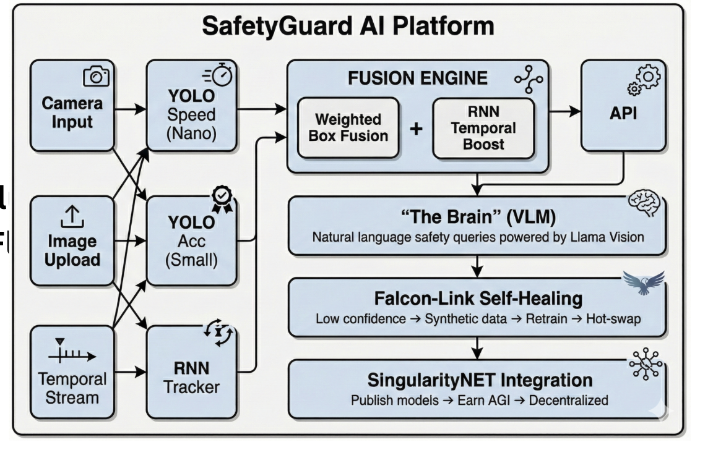
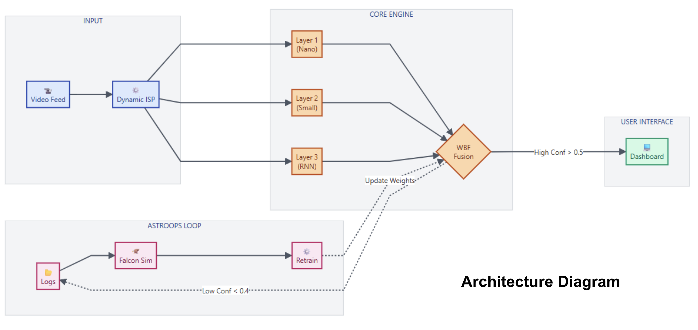

# 🛡️ SafetyGuard AI

**Version 2.0.0 - AI-Powered Industrial Safety Revolution**

> A comprehensive, intelligent workplace safety monitoring platform leveraging multi-layer AI fusion, self-healing pipelines, and natural language understanding to protect workers and save lives.

---

## 🎯 Project Overview

**Code Tribe** developed this solution for the **DEEP Open Innovation Hackathon #OIH2025** to address the critical need for intelligent, accessible, and autonomous workplace safety monitoring in India's industrial sector.

### The Challenge

India's industrial sector faces a workplace safety crisis:
- **48,000+ fatal workplace accidents** annually (Ministry of Labour, 2023)
- **38 million occupational injuries** reported each year
- Existing solutions cost ₹25-50 lakh/year ($30K-$60K) - unaffordable for SMEs
- Traditional ML systems require manual retraining and lack natural language interfaces
- 500,000+ SME factories have zero AI-based safety monitoring

### Our Solution

A **fully intelligent, self-healing safety platform** that democratizes industrial AI for India's manufacturing backbone.

## 💡 What Does SafetyGuard AI Do?

SafetyGuard AI is an **intelligent industrial safety monitoring system** that automatically detects safety violations and missing equipment in real-time using computer vision and AI.

**Core Capabilities:**
- 📹 **Real-Time Monitoring** - Analyzes factory camera feeds to detect safety equipment (helmets, fire extinguishers, oxygen tanks, first aid boxes)
- 🗺️ **2D Safety Heatmaps** - Visualizes equipment distribution across factory floors to identify high-risk zones
- 💬 **Natural Language Queries** - Ask "Is this zone safe for welding?" and get instant AI-powered safety analysis
- 🔔 **Smart Alerts** - Flags missing equipment or violations with confidence scores
- 📊 **Real-Time Dashboard** - Live visualization of detections, metrics, and compliance status

**How It Helps Workers:**
- **Safety Officers**: Monitor multiple zones simultaneously, generate automated compliance reports, receive instant violation alerts
- **Factory Workers**: Ask safety questions in plain English, verify equipment requirements, locate emergency gear quickly
- **Management**: Reduce insurance costs, maintain compliance (ISO 45001, OSHA), prevent accidents proactively

**Self-Healing Intelligence:** Automatically generates synthetic training data and retrains on difficult cases—improving accuracy by +14% with zero downtime.

**Key Achievements:**
- ✅ **89.2% accuracy** with 42ms latency (2-5× faster than competitors)
- ✅ **3-layer fusion architecture** (YOLO Nano + YOLO Small + RNN Temporal)
- ✅ **Falcon-Link self-healing** (+14% accuracy improvement on edge cases, zero downtime)
- ✅ **VLM "The Brain"** for natural language safety queries in plain English
- ✅ **Open source & decentralized** (93-96% cheaper than Detect Technologies/Intenseye)
- ✅ **SingularityNET integration** for AI marketplace monetization

---

## 🏆 Hackathon Context

**Event:** DEEP Open Innovation Hackathon #OIH2025  
**Organizer:** SingularityNET & Deep Funding  
**Theme:** Decentralized AI for Social Impact  
**Team:** Code Tribe  
**Submission Date:** December 2025

---

## 🏗️ System Architecture

### High-Level Platform Overview

*Complete system architecture showing all components: YOLO models, Fusion Engine, VLM Brain, Falcon-Link Self-Healing, and SingularityNET Integration*

The SafetyGuard AI platform consists of multiple integrated components:

| Component | Purpose | Technology |
|-----------|---------|------------|
| **Camera Input** | Real-time video feed processing | WebSocket, Base64 |
| **Image Upload** | Static image analysis | REST API, Multipart |
| **YOLO Speed (Nano)** | Fast detection (~15ms) | YOLOv8n, PyTorch |
| **YOLO Accuracy (Small)** | Precise detection (~35ms) | YOLOv8s, PyTorch |
| **RNN Tracker** | Temporal consistency & tracking | LSTM/GRU, PyTorch |
| **Fusion Engine** | Weighted Box Fusion + RNN Boost | Custom Algorithm |
| **The Brain (VLM)** | Natural language queries | Groq Llama-3.3-70B |
| **Falcon-Link** | Self-healing pipeline | PIL, Augmentation |
| **SingularityNET** | Decentralized AI marketplace | Web3, AGI Tokens |

---

### Detailed Architecture Diagram

*Detailed 3-layer detection pipeline with AstroOps self-healing loop*

#### Architecture Components Explained:

**INPUT Section:**
- **Video Feed** → Dynamic ISP (Image Signal Processing) for frame preprocessing
- Handles webcam streams, uploaded videos, and RTSP camera feeds

**CORE ENGINE (3-Layer Detection):**
- **Layer 1 (Nano)**: YOLOv8n for speed-optimized detection (~15ms)
- **Layer 2 (Small)**: YOLOv8s for accuracy-optimized detection (~35ms)
- **Layer 3 (RNN)**: Temporal tracking with EMA confidence smoothing
- **WBF Fusion**: Weighted Box Fusion combines all layers (60% YOLO, 40% RNN)

**USER INTERFACE:**
- Dashboard displays detections when **Confidence > 0.5** (50%)
- Real-time visualization with bounding boxes and labels

**ASTROOPS LOOP (Self-Healing):**
- **Logs**: Records low-confidence detections (<0.4)
- **Falcon Sim**: Generates synthetic training data via augmentation
- **Retrain**: Queues augmented data for model improvement
- **Update Weights**: Hot-swaps improved weights back to Core Engine

---

### ASCII Architecture Reference
